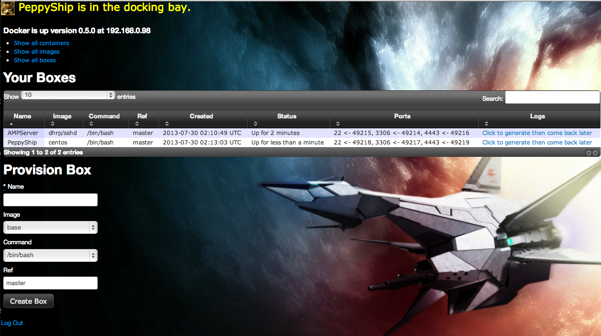

Docking Bay
===========

Docking Bay, a.k.a. FaderStack, is a Rails front-end for managing a process infrastructure using lightweight linux containers provided by the Docker project. 

Because I am building against the idea of OpenStack, Docking Bay currently uses ldap via devise ldap_authenticatable. You will need an ldap.yml in config/ and I have not provided an example. Sorry, but I am sure if you really want to run this you can figure out where to get the ldap.yml.example. You can also switch devise to use database_authenticable. Note to self, make a sane ldap.yml.example 

You will need to have Docker running and allow access from the appropriate network location (e.g. docker -d -H 0.0.0.0:4243 to allow from any IP, or local network/localhost only). Settings.yml contains some defaults, which you can override in settings.local.yml. These files also configure the possible images and commands that can be run.

Todo:
- Implement streaming container logs using websockets (tubesock), possibly a 2-way live terminal
- Use DNS, nginx, unionize.sh and/or iptables config to bind containers to arbitrary hostnames
- Allow manual spinning down of boxes
- Provide a Dockerfile for creating a container for running Docking Bay within Docker (there is currently a version checked in to the Docker registry that will work in the meantime)

